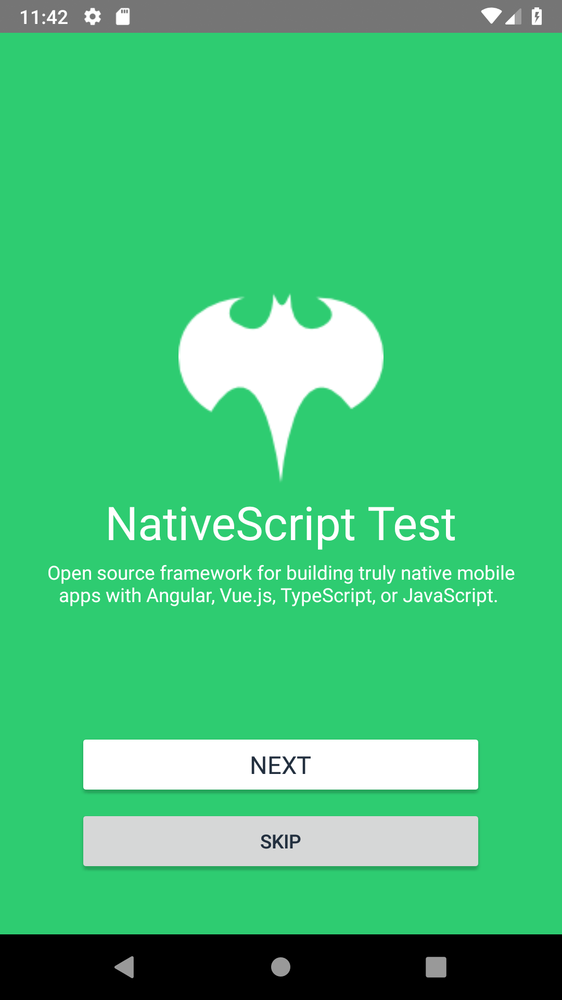

# NativeScript Test

Sample app of login

how to execute:

```console
$ npm install -g nativescript
```

```console
$ npm install
$ tns platform add android
$ tns run android --emulator
```


Requeriments:

| Component           | Recommended                    | Notes                                                      |
| ------------------- | ------------------------------ | ---------------------------------------------------------- |
| Android Development | Android 6.0 SDK (API level 23) | The minimum requirements is Android 4.2 SDK (API level 17) |
